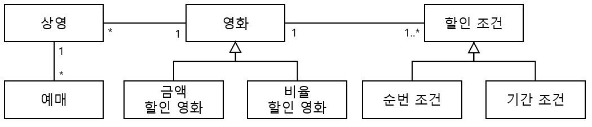
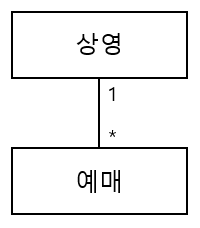
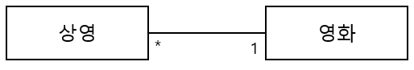
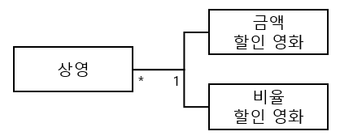
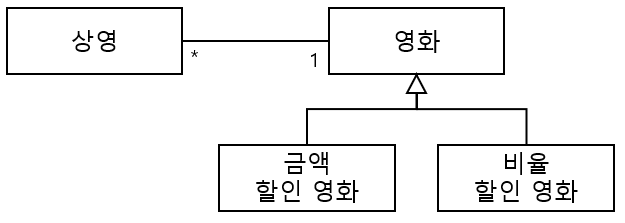
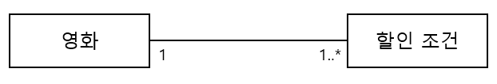
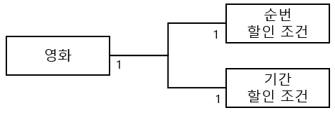
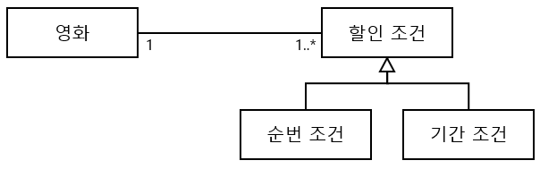
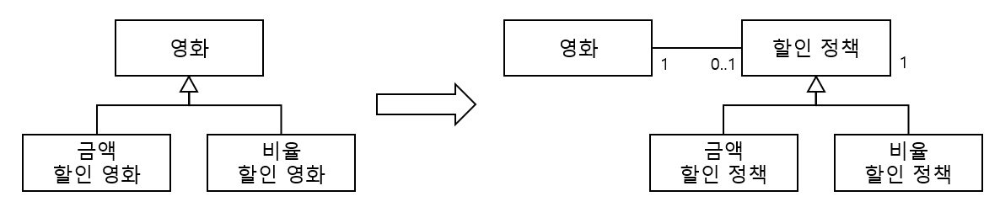
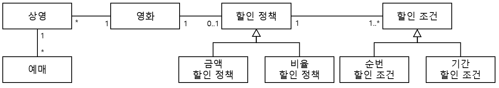

## 도메인 개념에서부터 다시 시작해보기

*domainNum:1*
- 하나의 상영은 여러번 예매될 수 있다.
- 하나의 영화는 여러번 상영될 수 있다.
- 영화는 금액이나 비율에 따라 할인될 수 있지만 동시에 두 가지 할인 정책을 적용할 수는 없다.
- 하나의 영화는 다수의 할인 조건을 가질 수 있다.
- 할인 조건에는 순번 할인 조건과 기간 할인 조건이 있다. 

### 책임할당 1
- 책임: 영화를 예매하는 것
- 메시지: 예매하라

- **Information Expert** - 영화를 예매하는 데 필요한 정보를 가지고 있는 객체를 찾는다.
    - 상영(Screening)은 영화에 대한 정보와 상영 시간, 상영 순번 등 영화 예매에 필요한 정보를 갖고 있다.
    - **Screening** 객체 선택
- **Creator** - 예매하라는 메시지에 있어서 예매정보를 가장 잘 알고 있고 긴밀하게 사용하고 있으며,
  초기화에 필요한 데이터를 갖고 있는 **Screening** 객체를 Reservation의 **CREATOR**로 선택
- 영화표의 가격을 계산해야 하는 책임이 존재

### 책임할당 2
- 책임: 영화표의 가격을 계산
- 메시지: 가격을 계산하라

- **Information Expert** - 영화표의 가격을 계산하는데 필요한 정보를 가지고 있는 객체를 찾는다.
    - 영화(Movie) 객체가 영화 제목과 영화표의 가격에 대한 정보를 갖고 있다.
    - Movie 객체 선택
    - 영화표의 할인 여부를 판단해야 하는 책임이 존재
- **Polymorphism** - 할인 정책별로 변하는 가격 계산의 로직이 있기 때문에 로직을 담당할 책임을 각 할인 정책별로 할당한다.
    - **Movie를** AmountDiscountMovie와 PercentDiscountMovie로 분리한다.
    - 분리된 각 클래스가 어떤 할인 정책을 가진 Movie인지 명확해졌다.

- **Protected Variation** - 할인 정책의 변화나 확장이 Screening 객체에 나쁜 영향을 미치지 않도록 모든 정책의 영화를 추상화하고,
  불안정한 세부 정책의 영화들을 캡슐화한다.
  - 공통적으로 할인 여부를 판단하는 구현을 공유할 필요가 있기 때문에 Movie 추상클래스를 사용하고 Movie를 실체화하는 
    AmountDiscountMovie와 PercentDiscountMovie 클래스

### 책임할당 3
- 책임: 영화표의 할인 여부를 판단
- 메시지: 할인 여부를 판단하라

- **Information Expert** - 영화표의 할인 여부를 판단하는데 필요한 정보를 가지고 있는 객체를 찾는다.
    - 할인 조건(DiscountCondition) 객체가 할인 여부를 스스로 판단할 정보를 가져야 한다. 
    - DiscountCondition 객체 선택
    - 할인 여부 판단의 결과를 반환한다.
- **Polymorphism** - 할인 조건별로 변하는 판단의 로직이 있기 때문에 로직을 담당할 책임을 각 할인 조건별로 할당한다. 
    - **DiscountCondition을** SequenceDiscountCondition(순번 할인 조건)과 PeriodDiscountCondition(기간 할인 조건)으로 분리한다.
    - 분리된 각 할인 조건 클래스에서 하는 역할이 명확해진다.(**High Cohesion**)
    

- **Protected Variation** - 할인 조건의 변화나 확장이 Movie에 나쁜 영향을 미치지 않도록 할인 조건을 추상화하고, 
  불안정한 세부 조건들을 캡슐화한다.
    - **DiscountCondition** 인터페이스를 실체화하는 SequenceDiscountCondition과 PeriodDiscountCondition 클래스
    - Movie 객체와 SequenceDiscountCondition, PeriodDiscountCondition 객체 간의 직접적인 Coupling을 피한다.(**Indirection**)  

### 좀 더 유연한 설계를 위해

- 상속 대신 합성을 사용한다.
- Movie와 DiscountPolicy의 결합도를 낮추어서 DiscountPolicy 인터페이스에 정의된 메시지를 통해서만 코드를 재사용한다.
- 질문: ***Indirection*** 패턴을 고려한 설계라고 볼 수 있는지... 

*domainNum:2*